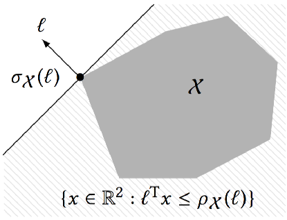

# Polyhedral Approximations

In this section we review the mathematical notation and results from convex
geometry that are used throughout `LazySets`.

```@contents
Pages = ["polyhedral_approximations.md"]
Depth = 3
```

## Preliminaries

Let us introduce some notation.
Let ``\mathbb{I}_n`` be the identity matrix of dimension ``n\times n``.
For ``p \geq 1``, the ``p``-norm of an ``n``-dimensional vector
``x \in \mathbb{R}^n`` is denoted ``\Vert x \Vert_p``.

## Support Function

The support function is a basic notion for approximating convex sets.
Let ``\mathcal{X} \subset \mathbb{R}^n`` be a compact convex set.
The *support function* of ``\mathcal{X}`` is the function
``\rho_\mathcal{X} : \mathbb{R}^n\to \mathbb{R}``, defined as

$\rho_\mathcal{X}(\ell) := \max\limits_{x \in \mathcal{X}} \ell^\mathrm{T} x.$

We recall the following elementary properties of the support function.

**Proposition.** For all compact convex sets
``\mathcal{X}``, ``\mathcal{Y}`` in ``\mathbb{R}^n``, for all ``n\times n`` real
matrices ``M``, all scalars ``\lambda``, and all vectors
``\ell \in \mathbb{R}^n``, we have:

```math
\begin{align*}
\quad \rho_{\lambda\mathcal{X}} (\ell) &= \rho_{\mathcal{X}} (\lambda \ell),
\text{ and } \rho_{\lambda\mathcal{X}} (\ell) = \lambda \rho_{\mathcal{X}} (\ell) \text{ if } \lambda > 0 \tag{1.1} \\[1mm]
%
\quad \rho_{M\mathcal{X}} (\ell) &= \rho_{\mathcal{X}} (M^\mathrm{T} \ell) \tag{1.2} \\[1mm]
%
\quad \rho_{\mathcal{X} \oplus \mathcal{Y}} (\ell) &= \rho_{\mathcal{X}} (\ell) + \rho_{\mathcal{Y}} (\ell) \tag{1.3} \\[1mm]
%
\quad \rho_{\mathcal{X} \times \mathcal{Y}} (\ell) &= \ell^\mathrm{T} \sigma_{\mathcal{X} \times \mathcal{Y}}(\ell) = \rho_{\mathcal{X}}(\ell_1^\mathrm{T}) + \rho_{\mathcal{Y}}(\ell_2^\mathrm{T}) \tag{1.4} \\[1mm]
%
\quad \rho_{\mathrm{CH}(\mathcal{X}\cup\mathcal{Y})} (\ell) &= \max (\rho_{\mathcal{X}} (\ell), \rho_{\mathcal{Y}} (\ell)) \tag{1.5}
\end{align*}
```

## Support Vector

The farthest points of ``\mathcal{X}`` in the direction ``\ell`` are the
*support vectors* denoted ``\sigma_\mathcal{X}(\ell)``.
These points correspond to the optimal points for the support function, i.e.,

$\sigma_\mathcal{X}(\ell) := \{ x \in \mathcal{X} : \ell^\mathrm{T} x  = \rho_{\mathcal{X}}(\ell)  \}.$

Since all support vectors in a given direction evaluate to the same value of the
support function, we often speak of *the support vector*, where the choice of
any support vector is implied.



**Proposition 2.** Under the same conditions
as in Proposition 1, the following hold:

```math
\begin{align*}
\quad \sigma_{\lambda\mathcal{X}} (\ell) &= \lambda \sigma_{\mathcal{X}} (\lambda \ell) \tag{2.1} \\[1mm]
%
\quad \sigma_{M\mathcal{X}} (\ell) &= M\sigma_{\mathcal{X}} (M^\mathrm{T} \ell) \tag{2.2} \\[1mm]
%
\quad \sigma_{\mathcal{X} \oplus \mathcal{Y}} (\ell) &= \sigma_{\mathcal{X}} (\ell) \oplus \sigma_{\mathcal{Y}} (\ell) \tag{2.3} \\[1mm]
%
\quad \sigma_{\mathcal{X} \times \mathcal{Y}} (\ell) &= (\sigma_{\mathcal{X}}(\ell_1), \sigma_{\mathcal{Y}}(\ell_2)), \text{ where } \ell = (\ell_1, \ell_2) \tag{2.4} \\[1mm]
%
\quad \sigma_{\mathrm{CH}(\mathcal{X}\cup\mathcal{Y})} (\ell) &=
\text{argmax}_{x, y} (\ell^\mathrm{T} x, \ell^\mathrm{T} y),
\text{ where } x \in \sigma_{\mathcal{X}}(\ell), y \in \sigma_{\mathcal{Y}}(\ell) \tag{2.5}
\end{align*}
```

## Polyhedral approximation of a convex set

The projection of a set into a low dimensional space (a special case of
``M \mathcal{X}``) can be conveniently evaluated using support functions, since
``\sigma_{M\mathcal{X}}(\ell) = \sigma_\mathcal{X}(M^T\ell)``.
Moreover, for some classical convex sets such as unit balls in the infinity
norm, in the ``2``-norm, or polyhedra in constraint representation, the support
functions can be efficiently computed.
For example, the support function of the unit ball ``\mathcal{B}_p^n`` is
``\rho_{\mathcal{B}_p^n}(\ell) = \Vert{\ell}\Vert_{\frac{p}{p-1}}.``

Given directions ``\ell_1,\ldots,\ell_m``, a tight overapproximation of
``\mathcal{X}`` is the *outer polyhedron* given by the constraints

```math
\begin{equation*}
\quad \bigwedge_i \ell_i^T x \leq \rho_\mathcal{X}(\ell_i) \tag{3}
\end{equation*}
```

For instance, a bounding box involves evaluating the support function in ``2n``
directions.
To quantify this, we use the following distance measure.

A set ``\mathcal{\hat{X}}`` is within Hausdorff distance ``\varepsilon`` of
``\mathcal{X}`` if and only if

$\mathcal{\hat{X}} \subseteq \mathcal{X} \oplus \varepsilon\mathcal{B}_p^n
\text{ and } \mathcal{X} \subseteq \mathcal{\hat{X}} \oplus
\varepsilon\mathcal{B}_p^n.$

The infimum ``\varepsilon \geq 0`` that satisfies the above equation is called
the Hausdorff distance between ``\mathcal{X}`` and ``\mathcal{\hat{X}}`` with
respect to the ``p``-norm, and is denoted
``d_H^p\bigl(\mathcal{X},\mathcal{\hat{X}}\bigr)``.

Another useful characterization of the Hausdorff distance is the following.
Let ``\mathcal{X}, \mathcal{Y} \subset \mathbb{R}^n`` be polytopes.
Then

$d^p_H(\mathcal{X}, \mathcal{Y}) = \max_{\ell \in \mathcal{B}_p^n}
\left|\rho_{\mathcal{Y}}(\ell) - \rho_{\mathcal{X}}(\ell)\right|.$

In the special case ``\mathcal{X} \subseteq \mathcal{Y}``, the absolute value
can be removed.

By adding directions using Kamenev's algorithm (s. below), the outer polyhedron
in (3) is within Hausdorff distance ``\varepsilon \Vert{X}\Vert_p`` for
``\mathcal{O}\left(\frac{1}{\varepsilon^{n-1}}\right)`` directions, and this
bound is optimal.
It follows that accurate outer polyhedral approximations are possible only in
low dimensions.
For ``n=2``, the bound can be lowered to
``\mathcal{O}\left(\frac{1}{\sqrt{\varepsilon}}\right)`` directions, which is
particularly efficient and the reason why we chose to decompose the system into
subsystems of dimension 2.

### Kamenev's algorithm

An overapproximation of the projections of a polyhedron given in constraint form
can be obtained using Kamenev's algorithm; this is a particularly effective
algorithm in two dimensions.
Kamenev's algorithm proceeds as follows.
Starting with at least ``n`` linearly independent template directions, compute
an outer approximation.
From the corresponding support vectors, compute an inner approximation, as the
convex hull of the support vectors.
Now compute the facet normals of the inner approximation, and the distance
between the facets of the inner and the vertices of the outer approximation.
Finally, pick the facet normal with the largest distance, and add it to the
template directions.
This procedure is repeated until the distance is smaller than the desired error.

For more details we refer to

Kamenev, G. K. (1996). An algorithm for approximating polyhedra. Computational
Mathematics and Mathematical Physics, 36(4), 533--544,

[Lotov, A. V., & Pospelov, A. I. (2008). The modified method of refined bounds
for polyhedral approximation of convex polytopes. Computational Mathematics and
Mathematical Physics, 48(6), 933-941
](https://link.springer.com/article/10.1134/S0965542508060055).
